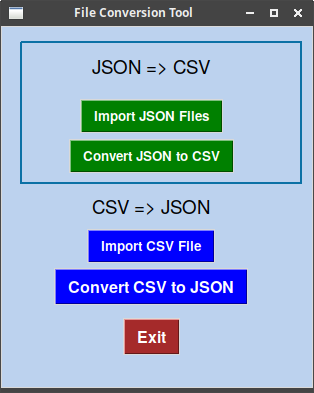
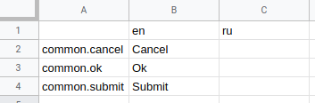
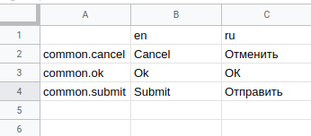
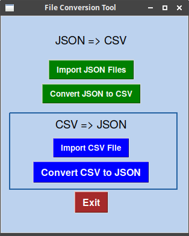

## Localization JSON Files Conversion Tool 

## Install and run

```bash
# dependencies
sudo apt-get install python3-tk 
sudo pip3 install pandas

# run
python3 gui.py
```


## JSON to CSV

JSON files 

```js
// en.json
{
  "common": {
    "ok":       "Ok",
    "submit":   "Submit",
    "cancel":   "Cancel"
  }
}

```
1. Import JSON to file coversion tool
2. Convert to CSV




Import CSV file to Excel / Google sheets

Set new columns. Ex: ru



Translate




## CSV to JSON
1. Export as CSV from Excel / Google sheets
2. Import CSV to file coversion tool
3. Convert to JSON



Output JSON files 

```js
// en.json
{
  "common": {
    "ok":       "Ok",
    "submit":   "Submit",
    "cancel":   "Cancel"
  }
}

// ru.json
{
  "common": {
    "ok":       "ОК",
    "submit":   "Отправить",
    "cancel":   "Отменить"
  }
}
```

